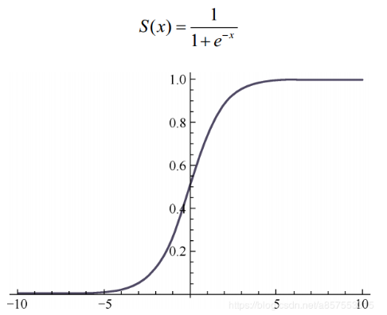
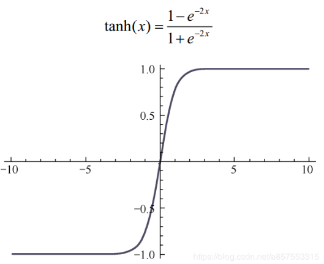
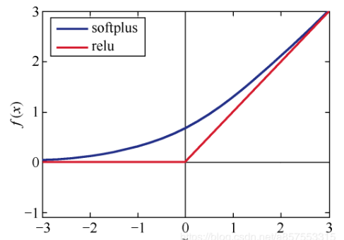

目前所有神经网络和SVM的基础都是1957年提出的感知机（perceptron）。

感知机是二分类线性模型，输入实例的特征向量，输出维实例的类别取+1和-1的值。

感知机无法进行异或这种简单的布尔运算，直到加入了激活函数。

**激活函数（activation function）**：其功能是加入非线性因素，弥补线性模型的表达能力。这同时也是神经网络能解决非线性问题的原因。

神经网络在数学基础上是处处可微的，因此选取的激活函数也要保证输入和输出是可微的。

激活函数不会改变输入数据的维度，只是将输入数据进行了转换，不同激活函数的转换目的不同。

Tensorflow包含两类激活函数

> 1. 平滑非线性激活函数，如sigmoid、tanh、relu、softplus和softsign
> 2. 连续但非处处可微，如relu、relu6、crelu和relu_x

Tensor中输入均为x（一个张量），输出均为与x数据类型相同的张量。

**梯度消失、梯度爆炸、梯度弥散**，梯度弥散是后边layer中参数的更新频率比前面layer中参数的更新频率快（几百倍）。

常见的激活函数有四种：sigmoid、tanh、relu和softplus

## 1.sigmoid
传统神经网络激活函数之一，另一个是tanh，的对应公式和图像如下：



使用方法如下：
```py
import tensorflow ad tf

a = tf.constant([[1.0,2.0], [1.0,2.0], [1.0,2.0]])
sess = tf.Session()
print(sess.run(tf.sigmoid(a)))

output:
[[0.7310586 0.880797 ]
 [0.7310586 0.880797 ]
 [0.7310586 0.880797 ]]
```

**sigmoid()优点**：输出映射在(0,1)之间，求导容易

**sigmoid()缺点**：具有软饱和性，落入饱和区f'(x)会变得非常接近于0，容易产生**梯度消失**。

> 1. 软饱和：指激活函数h(x)在取值趋于无穷大时，它的一阶导数趋于0。
> 2. 硬饱和：当|x| > c时，f'(x)=0。relu就是一类左侧硬饱和激活函数。
> 3. 梯度消失：在更新模型参数时采用链式求导法则反向求导，越往前梯度越小。最终的结果是到达一定深度后梯度对模型的更新就没有任何贡献了。

## 2.tanh
函数的公式和图像如下图所示：



**tanth()优点**：输出以0为中心，收敛速度比sigmoid快。

**tanth()缺点**：具有软饱和性，但仍然有梯度消失的问题。

## 3.relu
relu是目前最受欢迎的激活函数。

softplus是relu的平滑版本。

relu的定义为：f(x)=max(x,0)

softplus的定义为：f(x)=log(1+exp(x))

这两个激活函数的函数图像如下所示：



如上图所示，对于relu函数
> 1. x > 0时，f'(x)=1，此时保持梯度不衰减，从而缓解梯度消失问题。
> 2. x < 0时，硬饱和。

Relu优点：
```
1. 可以使网络训练更快：因其倒数形式简单，更好求导。
2. 增加网络的非线性：本身是非线性函数。
3. 防止梯度消失：当数值过大或过下，sigmoid和tanh因软饱和性，倒数接近零，Relu为非饱和激活函数不存在这种现象。
4. 网络具有稀疏性：Relu大于0的部分才有值，所以可以减少过拟合。
```


使用方法：
```py
import tensorflow ad tf

a=tf.constant([-1.0, 2.0])
with tf.Session() as sess:
	b = tf.nn.relu(a)
	print(sess.run(b))

output:
[0,2.]
```

## 4. 激活函数的选择
当输入数据特征相差明显时，用tanh的效果会很好，并且在循环过程中不断扩大特征效果并显示出来。

当输入数据特征相差不明显时，sigmoid效果比较好。


